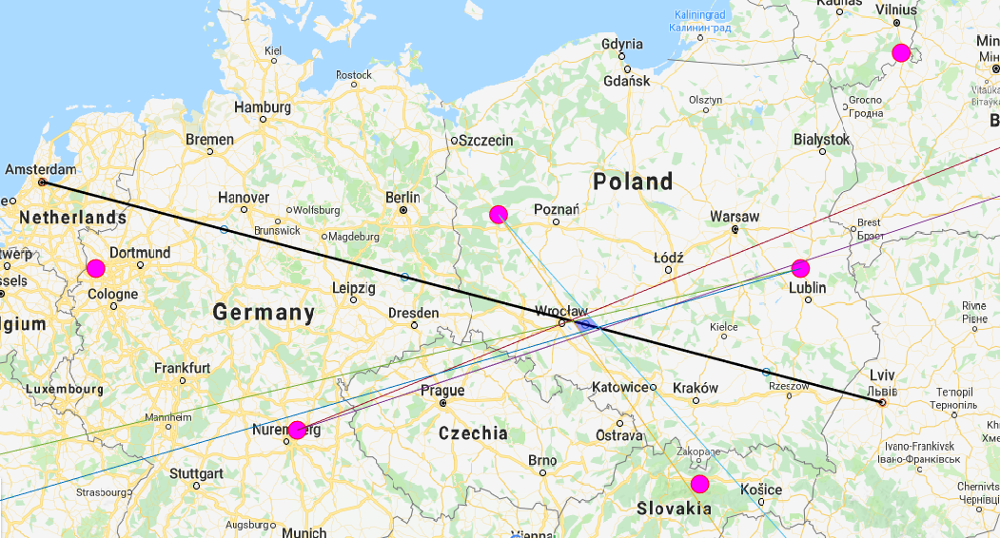

# Navigation with 3 Non-Directional Beacons

This application plans the navigation of an aircraft based on non-directional beacons ([NDBs](https://en.wikipedia.org/wiki/Non-directional_beacon)). It selects the best combination of NDBs at several points of the journey using triangulation. The program shows a map, with NDBs distributed on it, and it asks the user to select the starting and finishing point of the route. After pressing enter, it is displayed the selected NDBs with an error area of the aircraft location. 

 
